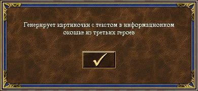

# Астрологи объявили...-бот


## Использование

Живет [здесь](https://t.me/astrologers_bot)

Работает в личке и в инлайн-режиме. Но поскольку ничто в жизни не должно быть просто,
инлайн-запросы очень сильно урезаны по символам. В личке ограничение уже побольше, 4096 символов на сообщение


## Поднять самому

Можно запустить в докере. В `params.env` задаются две переменные, `ASTROLOGERS_BOT_TOKEN` и `ASTROLOGERS_PRIVATE_CHANNEL`.
С первой все понятно, со второй смотри выше: ничто в жизни не должно быть просто

Инлайн-запросы не умеют принимать в качестве ответа просто фото/аудио/файл, они умеют принимать либо ссылку куда-то вовне,
либо `fileId` файла, который уже был загружен в телегу. Поэтому чтобы инлайн-режим работал,
надо создать приватный канал, добавить туда бота чтобы он туда спамил инлайн-фоточкам и записать в переменную айдишник этого канала

После этого запускать как обычно:  
```
docker run -d \
    --restart unless-stopped \
    --name astrologers_bot \
    --env-file params.env \
    graynk/astrologers_bot
```

### Стендэлон режим
Можно просто передать текстовый файл на вход, игнорируя всю часть с ботом:

`python3 standalone.py file.txt`