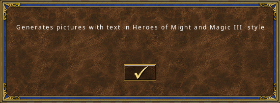

# Astrologers Announced...-bot


## Usage

Lives [here](https://t.me/astrologers_bot)

Works in private chats and in inline mode. But since nothing in life should be simple, inline requests are heavily limited in characters (by Telegram).

## Development

This project uses [just](https://just.systems) as the command runner.

Run `just --list` to see the list of available commands.

To run the bot yourself:
1. Install Elixir
2. Copy `config/dev.secret.example.exs` to `dev.secret.exs`
3. Set your token from `@BotFather` and set up a channel to send the pictures to.
4. `just run`

Alternatively, run with docker like this:

```
docker run -d \
    --restart unless-stopped \
    --name astrologers_bot \
    --env-file params.env \
    ghcr.io/graynk/astrologers_bot:latest
```
